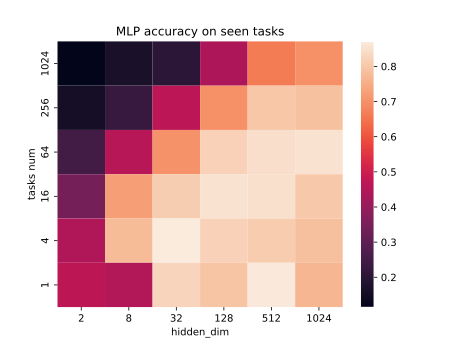

# Описание
В репозитории содержится код для воспроизведения экспериментов из статьи [GPICL]([url](https://arxiv.org/pdf/2212.04458.pdf)https://arxiv.org/pdf/2212.04458.pdf).  
Для этого были реализованы:
* Датасеты для генерации новых задач из существующих данных (`src.datasets.task_generation.PermuteProjectTaskGenerator`, `src.datasets.dataset.MetaLearningDataset`)
* Функция потерь для мета-обучения (`src.loss.MetaLearningLoss`)
* Модели MLP(`src.models.MLP.MetaLearningMLP`), Transformer(`src.models.Transformer.MetaLearningTransformer`)
* Код для обучения моделей (`src.model_trainer.Trainer`)
* Для логирования и воспроизоводимости экспериментов использовался Wandb
# Эксперименты
Во всех экспериментах в качестве базового датасета используется MNIST. Базовый датасет делится на train, val, test. Val используется для подбора гиперпараметров (lr) и early stopping. Итоговое качество оценивается на test. Алгоритм оптимизации - Adam. Воспроизводились эксперименты соответствующие Figure 2 в оригинальной статье.
## MLP
  
Удалось воспроизвести эксперименты с MLP, но в силу ограниченности ресурсов, построенная HeatMap отличается от статьи: в построенной HeatMap в два раза меньше высота (поэтому темноты сверху так явно не видно) и используется больший шаг по проверяемым параметрам. При этом основная идея на полученном графике видна - существует линейная граница, которая показывает, что с увеличением размера модели, увеличивается количество задач, которые она может научиться решать, однако оно ограничено.
Для оценки качества выбирались случайные 8 заданий (там, где заданий было больше 8) из test и считалась среднее accuracy по ним. Также надо отметить, что полученные модели недообученные, в связи с тем, что времени и ресурсов на их полное обучения не имелось.
## Transformer
  
Были проведены три эксперимента, в которых фиксировался размер модели - 32 и изменялось количество заданий (8, 32, 128). Модель показывает хорошее качество, однако для исследования способности модели к In-Context Learning требуется проведение большего числа экспериментов.
